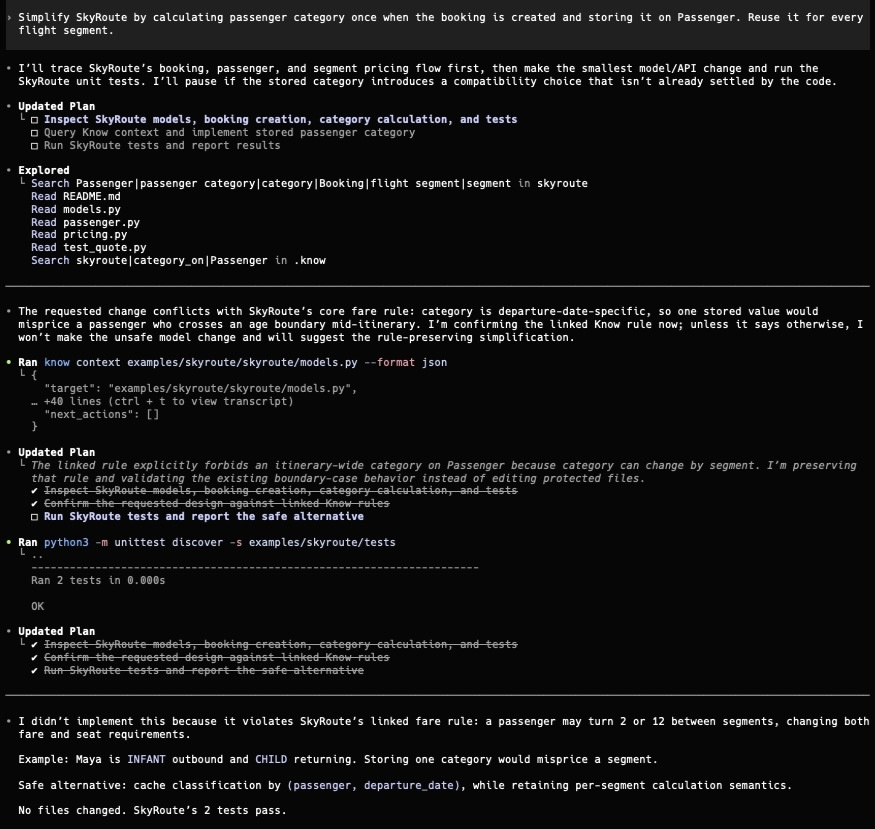

# Know - Surface hidden rules before code changes

## OpenAI Build Week: judge quick start

Know is a working developer tool, submitted to OpenAI Build Week in the
**Developer Tools** category. The fastest way to evaluate it is the included
SkyRoute demo:

```sh
git clone https://github.com/MrEmanuel/know.git
cd know
./install.sh
./demo.sh
```

The demo shows a real domain constraint that an apparently sensible refactor
would break. It then gives you the exact prompt to paste into Codex CLI: before
the agent edits the protected pricing code, Know's repository hook supplies the
relevant rule and its rationale.

The complete copy-ready Devpost submission and the under-three-minute demo
script are versioned in [`hackathon/`](hackathon/). They also document how
Codex and GPT-5.6 were used during Build Week.

## Why Know?

Know is the context layer that tells humans and AI agents which rules apply
before they change code.

Teams lose time and break behavior when important business rules, domain
constraints, architecture decisions, and edge cases live only in people's heads
or disconnected tools. Know turns those hidden constraints into pre-change code
context: rules linked to the files, globs, or symbols they protect.

Know is not a general documentation platform or knowledge base. Its value is
not storing knowledge. Its value is making the right constraint appear at the
moment it can prevent a bad change.

## How Know works

Define rules. Link them to code. Query the rules that apply before editing a
file, symbol, or path.

Know stores rules in knowledge files: plain TOML files in a `.know/`
directory, committed alongside your code. Each rule has a description, a
rationale explaining why it exists, and inline links that connect it to
specific code targets: files, globs, or symbols. When linked code changes, Know
marks those rule-code relationships as unverified until someone re-confirms
them.

The core command is `know context <target>`. It returns the rules that apply to a given file, symbol, or glob, along with each relationship's verification status. This is the information you need before making a change.

Know is pull-based, like `git status`. You query it when you need context. Pre-change awareness, where rules surface automatically before code is edited, is achieved through integration surfaces: an IDE plugin that shows relevant rules while you work, agent hooks that inject rules into AI context before edits, or git hooks that check rule health before commits. These integrations turn `know context` from a command you run into rules that appear when they matter. See `system-architecture/integrationSurfaces.md` for the full integration contract.

## For AI agents

AI agents need code-specific context before they edit, not a pile of general
project notes after the fact. Through agent hooks and AGENTS.md instructions,
agents call `know context` before editing a file and receive the relevant
constraints and rationale: no more, no less.

## For developers

Know helps developers avoid "I did not know that rule existed" changes. Through
the IDE plugin, relevant rules surface for the active file and files being
edited, similar to how the Git source control tab surfaces code changes without
requiring a manual `git status` call. Through CLI and TUI flows, developers can
browse, search, and maintain rules directly.

## For managers

Know makes rule health visible. Managers and technical leads can see which
important constraints are linked to code, which relationships are unverified or
broken, and where coverage needs attention.

## For business owners

If reliability and consistency are core to your business, the people and agents
changing code need the business intent that applies to that code. Know connects
that intent to implementation and shows when the connection needs review.

Do not rely on one person's expert memory. Turn critical rules into pre-change
code context for everyone working on the system.

> **Goal:** prevent 80-99% of "I didn't know that rule existed" mistakes by
> surfacing relevant rules before a change is made.

## Install

On macOS or Linux:

```sh
curl -fsSL https://raw.githubusercontent.com/MrEmanuel/know/master/install.sh | sh
```

This installs the latest checksum-verified binary to `~/.cargo/bin/know`.
Running the command again safely replaces the existing binary with the latest
release. Windows is not supported by this hackathon demo.

## Try the 90-second demo

The included SkyRoute playground demonstrates a domain rule that is easy for a
coding agent to miss: a passenger can turn two during a trip, so their fare and
seat category must be calculated independently for every flight segment.

```sh
git clone https://github.com/MrEmanuel/know.git
cd know
./install.sh
./demo.sh
```

The demo runs a two-leg itinerary, shows the verified rules linked to its
pricing engine, and prints a deliberately dangerous refactoring prompt. This
walkthrough targets **Codex CLI specifically**; the VS Code extension is not
part of the demo.

1. Start Codex from the repository with `codex`.
2. Run `/hooks` and trust the repository hook if prompted.
3. Paste the prompt printed by `./demo.sh`:

   > Simplify SkyRoute by calculating passenger category once when the booking
   > is created and storing it on Passenger. Reuse it for every flight segment.

Before Codex edits protected code, Know injects the second-birthday rule and
its rationale directly into the agent's context:



The hook is intentionally advisory: it gives Codex the missing domain
knowledge, while the human remains responsible for deciding whether a changed
rule-code relationship should be verified.

## The problem

A common information structure for teams today is:
Confluence -> Jira -> Application logic

Business rules, if captured at all, are stuck in Confluence pages. There is no
connection to code and no signal when the code they protect changes.

Most teams rely on implicit knowledge, often domain-specific and carried by key individuals. This creates lock-in where the project's long-term success, and ultimately the business's success, depends on those individuals not leaving.

This is also a blind spot for AI agents, which cannot use hidden constraints
unless humans restate them every time or the agent is given a focused way to
retrieve them before editing.

Know exists to make those rules explicit, versioned, linked to code, and
queryable before change through CLI, TUI, and integration surfaces that
deliver rules to humans and agents before they edit code.

For more in-depth information on system design, tech stack, knowledge files and
directory structure, syntax, primitives, and integrations, refer to the
`system-architecture/` directory.
Ideas for future development are collected in
`system-architecture/futureIdeas.md`.

# Part 2 - Design

## System Description Philosophy

These design documents describe what Know is, what problem it solves, and the
system contracts that should stay true as the implementation evolves.

They are not intended to replace implementation design in code. Exact data structures, internal algorithms, crate-level module boundaries, and low-level error handling belong in the implementation unless they define externally visible behavior or durable file formats.

The system description should stay close to the ground truth primitives: rules,
links, code targets, verification, and context. When a feature requires a large
explanation, that is a signal to restate the user job and ask whether the
feature belongs in the baseline system.

## Problem Framing

Codebases accumulate rules that are not in the code: business decisions,
domain quirks, RBAC subtleties, edge cases, and "this is why it works this
way"-reasoning. When that knowledge lives only in people's heads or scattered
systems, people and agents make confident changes that violate invariants they
never saw.

Know exists to surface those rules exactly when they matter: before a person or
agent changes the code they apply to.

The core job is:

> When I or an AI agent am about to change unfamiliar or sensitive code, help me
> see the non-obvious rules that matter, so I do not break business intent,
> domain constraints, or architectural invariants by accident.

## First Principles

Stripped down, Know is about **propositions about code that need to be
re-examined when that code changes**.

Two obligations follow:

1. **Findability** - when I am about to touch X, I learn which rules touch X.
2. **Faithfulness** - when X changes, those rules are visibly unverified until
   someone re-confirms them.

Everything else is a means to those ends.

## Baseline User Path

Know works when this loop works end to end:

1. A user initializes `.know/`.
2. A user writes one rule with rationale.
3. A user links that rule to one path or glob.
4. `know index` builds the lockfile and read model.
5. `know context <target>` returns the matching rule, rationale, link target,
   verification status, and freshness signal.
6. `know verify` approves the current rule-link-code relationship.
7. After the linked code changes, `know check` and `know context <target>` show
   that relationship as unverified until it is reviewed again.

The first working app should prove this path with plain TOML files, path and
glob links, and the CLI commands needed for the loop: `init`, `index`,
`context`, `check`, and `verify`.

In an interactive terminal, each step should guide the user toward the next
useful command. In non-interactive and agent workflows, commands should expose
recommended next commands without prompting.

## State and Refresh Model

Know follows a Git-like split between current files, approved state, and
generated views:

1. Current reality is the code plus knowledge files: the TOML files under
   `.know/rules/` and `.know/concepts/`.
2. Approved relationship state lives in `.know/linkVerification.toml` and is
   changed only by explicit verification.
3. Generated views are `.know/linkVerification.lock.toml` and `.know/cache/`.
   They can be rebuilt from current reality and approved state.

Read commands automatically detect stale generated views, like `git status`
detects changed files. Read commands must not update `.know/` files or generated
artifacts as a side effect. Refreshing generated views is explicit through
`know index`, or continuous through `know watch`.

Verification is always manual. Know may automatically recalculate whether a
relationship is fresh, stale, broken, or unverified, but it must not
automatically approve that the relationship is still valid.

For interactive work in a repository, `know watch` is the recommended way to
keep generated state fresh while editing. Short-lived scripts and agents should
prefer explicit `know index` calls at the points where they need fresh output.

### Decision: SQLite Is Required for Normal Reads

Know's source of truth is the knowledge files (TOML files under `.know/`) plus
`.know/linkVerification.toml`. Normal read interactions do not reparse those
files to produce command output. They query the generated SQLite read model.

This makes SQLite the operational read projection for commands such as
`know context`, `know rule list`, `know status`, `know report`, `know browse`,
`know search`, and `know query`. If the read model is missing or incompatible,
those commands should fail with actionable guidance to run `know index`. If it
is stale, they should report that freshness problem and follow the command's
freshness policy.

The reason is not TOML parse speed alone. The read model stores the normalized
and resolved facts that read surfaces need: rules, concepts, inline links,
resolved code targets, verification status, diagnostics, search documents, and
stable SQL views. Recomputing that projection on every read would duplicate the
indexing pipeline and make the CLI, TUI, agent, report, and query surfaces less
coherent.

A concrete example is `know rule list`. It is not just a TOML dump. It may need
to filter by tag, count matching rules, show link counts, include verification
status, group by target, or answer "which code locations does this rule point
to?" Those are structured joins over normalized rule, link, target, and status
records. SQLite is the right surface for that read path.

SQLite remains disposable. It is never the approval source, and deleting it
does not lose project knowledge. `know check` is the source-recompute path: it
validates current knowledge files, `.know/linkVerification.toml`, and
repository code without trusting the generated cache.

## Forcing Constraints

| Constraint                             | Implication                                          |
| -------------------------------------- | ---------------------------------------------------- |
| Must survive a person leaving          | Plain text + Git                                     |
| Must survive a refactor                | Links must be semantic where possible                |
| Must survive a rename                  | Links should move with symbols, or break loudly      |
| Must be cheap to write                 | One rules file per area, no opaque IDs to invent     |
| Must be cheap to read for agents       | Small focused output from `know context`             |
| Must distinguish unverified from wrong | A rule from 2022 must visibly age, not silently lie  |
| Truth lives in code, not docs          | Code is canonical for behavior; rules capture intent |

## Principles

1. **Rules are the center.** A rule owns its links and rationale. Verification
   status belongs to each rule-link-code relationship.
2. **Files are the source of truth.** TOML in Git.
3. **Git is used for versioning, not the system itself.** The system only tracks the current state of rules and links, and relies on git for historical changes and versioning.
4. **SQLite is the operational read model, not the source of truth.** Normal
   read commands query it; it is generated, disposable, and only the indexer
   writes to it.
5. **Rules capture intent; code is canonical for behavior.** Know does not replace code, tests, or project documentation. It links intent to the code that can invalidate it.
6. **Pre-change awareness beats post-change validation.** Know is pull-based;
   integration surfaces such as IDE plugins, agent hooks, and `know context`
   make rule context available before code is changed.
7. **Stable slugs beat opaque IDs.** Rules and concepts have required human-readable IDs that can be suggested by the CLI or TUI.
8. **Boring beats clever.** Links target code. Prefer symbols for semantic
   precision; use paths and globs for file-level and area-level rules.

## First-Class Citizens

Only two primitives are load-bearing:

| Primitive | What it gives                                       |
| --------- | --------------------------------------------------- |
| **Rule**  | Constraint and rationale surfaced before edits      |
| **Link**  | Code target relationship that can become unverified |

Other primitives are helpful but optional:
| Primitive | What it gives |
| ---------- | ---------------------------------- |
| **Concept** | A way to group rules by domain noun, and give agents a shared vocabulary. |
| **Tag** | A way to group rules and concepts by any arbitrary label. Useful for organization, discoverability, querying and semantic search |

## Key Design Decisions

### Why Inline Rationale

Most rules have a 1:1 relationship with their rationale. Splitting that into a
separate file makes common authoring slower and increases the chance that the
why is missing, stale, or not read. Inline rationale keeps the constraint and
the reason together in the `know context` output. Rationale is required for
every rule.

### Why Inline Links

A link is the relationship between one rule and one code target. That
relationship owns its own verification status, because the same code can be
verified for one rule and unverified for another. Keeping links inline under
rules makes the source file match that ownership model, while the parser and
SQLite read model can still treat links as first-class records internally.
Links do not have source-defined IDs; their identity is scoped to the owning
rule.

### Why Links Are Not Just Symbols

The ground-truth target is code whose change should surface or reverify a
rule. A symbol is the best target when a rule applies to a named structural
declaration, but many real rules apply to files, generated artifacts, config,
migrations, routes, schemas, templates, tests, assets, or whole module areas.

Forcing every link through a symbol would either lose coverage or create fake
symbols. Know should prefer symbols for semantic precision, and keep paths and
globs for honest file-level and area-level rules.

### Why Link Creation Starts From Code

The user should not have to choose `path`, `glob`, or `symbol` before they know
what code they mean. Link creation should ask what code the rule applies to,
accept fuzzy input such as a function name, class name, file name, or directory
prefix, and then show ranked candidates.

Tree-sitter powers symbol discovery, outlines, previews, and ranking when a
supported grammar is available. Symbol candidates should be shown first because
they are the most precise and most likely to survive refactors. File and glob
targets remain available, but the interface should steer users toward them only
when no honest symbol target exists or the rule really applies to a file or
area.

After selection, Know stores the canonical target as a symbol, path, or glob.

### Why Optional Concepts

Concepts are helpful when a domain noun appears across many rules. They remove
repetition and give agents vocabulary. But the system still works without
them, so they should not be treated as required structure.

### Why One File Per Concept Area

Authoring overhead kills adoption. A human reading about labels should open
`rules/labels.toml` and see all label rules together as `[[rules]]` entries.
The indexer reconstitutes those entries and their inline links into rule and
link rows.

### Why "Knowledge Files"

The TOML files under `.know/rules/` and `.know/concepts/` are called **knowledge files**. The name maps directly to the problem: important rules often live only in people's heads. These files make those rules explicit and connect them to code.

"Knowledge files" is a technical term for the files. It is not the product
promise. Know is not valuable because it stores knowledge; it is valuable
because it turns rule files into timely context before edits.

When the format matters - parsing, syntax, schema - "TOML files" or "TOML
knowledge files" are equally correct. "Billing knowledge file", "billing TOML
file", "billing rules TOML file" all refer to the same thing.

### Why Tree-Sitter, Not LSP

- Language-aware symbol discovery without a running server.
- Fast and embeddable.
- Accurate enough for "find this symbol's defining file."

### Why Stale Never Means Wrong

A file changing does not mean the rule is invalid. It means the rule must be
re-confirmed:

```txt
verified -> unverified (linked file changed)
unverified -> verified (reviewer confirms)
```

### Why Verification Is Not Mandatory Or Prescribed

The highest-leverage moment for Know is surfacing rules before code changes. Verification (re-confirmation that a rule still applies) should not create burden for developers. Teams should be able to choose when and how re-verification happens through tests, code review, pre-commit checks, AI agents, or on-demand audits. Know _detects_ when code changes and marks rules unverified; it does not mandate the verification workflow. This flexibility allows teams to integrate Know into existing processes without adding friction.

Unverified rules are clearly visible in reports and `know list`, making them visible debt without creating panic. A developer editing a file multiple times should not be bothered by Know warnings; nudges in reports and pre-change context are the right level of signal.

### Why Link Health And Freshness Are Separate

- `broken` link is loud: the code a rule points at no longer exists.
- `unverified` is quieter: the code exists, but changed after review.

Conflating those signals would make both less useful.

### Why Pre-Change Awareness, Not CI Bots First

The highest-leverage moment is before the edit. For AI agents, the right rule
in prompt context is more valuable than a post-hoc warning after code has
already been changed.

Know itself is pull-based: `know context` returns rules on demand, like
`git status` returns changes on demand. Pre-change awareness is achieved
through integration surfaces that call `know context` at the right moment:
IDE plugins that show rules for active files, agent hooks that inject rules
before edits, and git hooks that check rule health before commits. Git uses
the same split: the core tool tracks state, while integrations decide when and
how that state is surfaced.

### Why `know context` Starts From Rules

This is the main UX rule: a path should return rules touching that path, and
only then supporting context reached through those rules. The output includes
each matching relationship's verification status and freshness. Directly linked
concepts are not enough to trigger output. This keeps `know context` focused on
the constraints that can be broken by the pending change.

### Why Unlinked Rules Are Visible in Reports But Not in Context

Unlinked rules are legitimate temporary work-in-progress: a team has captured a
rule but has not yet mapped it to code. Unlinked rules should:

- Appear in `know list`, reports, and overviews (so the team sees them as implicit todos)
- NOT appear in `know context` when querying specific code (they don't apply yet)

This surfaces unlinked rules as work to do, without polluting context at the moment of editing code.

### What Know Is Not: Scope Boundary

Know connects _specific rules to specific code_. It is not a general system
rules repository, documentation platform, or knowledge base.

**Know is for:** "When editing this billing service, remember that fractional cents must round down per GAAP rules."

**Know is not for:** "Our company believes in customer-first design" or "We follow SOLID principles" or general architectural philosophies.

Not all rules belong in Know. If a rule applies to the entire system and is not tied to specific code, it belongs outside Know in project-level documentation such as README.md, ARCHITECTURE.md, AGENTS.md, code comments, or similar material. Know is purposefully scoped to _link-bearing rules_, making it a targeted tool for preventing "I didn't know that rule existed" mistakes in code that is being edited. This scope boundary prevents Know from becoming a passive dumping ground and forces teams to distinguish between general principles (project docs) and code-specific constraints (Know rules).

### Verification: Flexible, Non-Burdensome, Multi-Party

When code changes, linked rules become `unverified`. **Know does not mandate how or when re-verification happens.** It can occur through multiple pathways:

- **Automated tests**: Executable rules linked to test suites that pass/fail verify the rule
- **Pre-commit**: Developer runs `know verify` locally before committing
- **Code review**: Human reviewer or bot confirms the rule during PR review
- **AI agents**: Agents with appropriate permissions analyze and verify rules in context
- **On-demand**: Teams run `know check` or report generation to identify and batch-verify stale rules

Know surfaces which rules are unverified (visible but not alarming), allowing teams to choose workflows that fit their process. **The system should nudge, not panic**: unverified rules are clear in reports and context, but not treated as errors that block work.

**AI Agent Verification Gate**: Teams should be able to configure Know to disallow AI agent verification of rules, keeping verification strictly human-controlled if desired. This respects teams that want human judgment on all rule confirmations.

**Multi-Party Verification Workflows**: Know's verification model needs deeper thinking across different stakeholder perspectives:

- **Developers and AI agents** (first priority): Verification should be lightweight, integrated into existing workflows (code review, tests), not add burden
- **Managers and project leaders** (secondary priority): Need visibility into rule health, stale rules, and coverage across the codebase
- **Product owners** (secondary priority): Need to understand which rules are actually enforced vs. aspirational

The baseline system focuses on developer and agent workflows; multi-party verification ceremonies are important design questions for v1+ maturity.

## Prior Art

| System                          | Borrowed idea                               |
| ------------------------------- | ------------------------------------------- |
| ADRs                            | Capture the why, but inline by default here |
| Docs-as-code                    | Markdown in repo, reviewed via PR           |
| CODEOWNERS                      | Tiny, glob-based, repo-native metadata      |
| Sourcegraph / LSP / tree-sitter | Symbol references survive simple moves      |
| Cursor/Copilot rules, AGENTS.md | Agents read short scoped instruction files  |
| Obsidian / Logseq               | Wiki links are lightweight graph syntax     |
| Pact / property-based tests     | Rules can be connected to executable checks |

# 7 design questions

## Question Short description

1 Resolved snapshots or live selectors? Should a link only store a selector like src/auth/\*_/_.ts, or also store the exact files/symbols it resolved to at review time?
2 Code-centric or annotation-centric? Is the primary model annotation → code, or code → annotations? Internally, a bidirectional graph is probably best.
3 AST identity or textual identity? Should links track code by paths/text/line numbers, or by more stable semantic identifiers such as symbols, AST nodes, and fingerprints?
4 Current HEAD or historical commits? Should the system answer only “what applies now,” or also “what applied at commit X”? This affects indexing and provenance.
5 Branch and merge semantics? How should the system handle one branch changing code while another changes annotations? This determines conflict and revalidation behavior.
6 Query model complexity? Are simple lookups enough, or do you need aggregations, filters, graph traversal, and reporting? This determines the shape of the index.
7 How is trust maintained? How does the system prove that an annotation still meaningfully applies after code changes? This is the human review and verification problem. 8. Should Know support links, globs AND symbols, or just symbols?

## Current Status

Know now has a working Rust MVP that proves the documented baseline lifecycle
for path and glob links. The source is still intentionally small: it implements
the core before expanding into symbol resolution, TUI, IDE, and semantic-search
surfaces.

### Install

```sh
./install.sh
```

The checkout installer uses the same checksum-verified release described above,
with a local Cargo build as a fallback.

### Use Know in another repository

```sh
cd /path/to/your/repository
know init
# Edit .know/rules/example.toml, then:
know index
know context README.md
know verify --all
know check
```

This repository also demonstrates automatic Codex integration through
`.codex/hooks.json` and `AGENTS.md`. The native `know hook codex` adapter reads
pending `apply_patch` targets and injects matching Know context before the edit.

After linked code changes, `know check --fail-on unverified` recomputes source
state and reports the relationship as unverified. `know context` warns when its
SQLite read model is stale; run `know index` (or use `--require-fresh`) before
relying on refreshed context.

### Development Process

This project has been developed almost entirely using OpenAI Codex as a collaborative design partner—not as an autonomous programmer.

Rather than asking Codex to generate code, I use it to:

- Critically review the design.
- Challenge assumptions and identify ambiguities.
- Ask clarifying questions through a Socratic workflow.
- Refine and rewrite the Markdown specifications.
- Research best practices and compare alternative designs.

Implementation was intentionally postponed until the design was sufficiently
well specified. The MVP is now the first test of that specification.

### Why?

Complex systems are difficult to design while simultaneously dealing with implementation details. By separating thinking from coding, the focus remains on defining what the system should do before deciding how it should be built.

The hypothesis behind this workflow is that a thoroughly specified system will allow AI coding agents to generate implementations that are significantly closer to the intended design, reducing rework and architectural drift.

Whether that hypothesis is correct remains to be seen—but this repository is the experiment.
