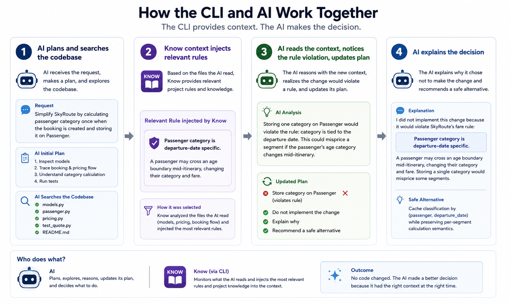

# Know

<p align="center">
  
</p>

<p align="center">
  <strong>Active memory for code.</strong><br />
  Surface the business rules, decisions, and constraints that matter <em>before</em> a human or AI agent changes code.
</p>

<p align="center">
  <a href="#quick-start">Quick start</a> ·
  <a href="#see-it-work-with-codex">See it work</a> ·
  <a href="#how-it-works">How it works</a> ·
  <a href="system-architecture/">Architecture</a>
</p>

<p align="center">
  Rust · SQLite · TOML · Codex CLI · MIT License
</p>

> [!WARNING]
> **Alpha software:** Know's core workflow is working, but its commands,
> configuration, and integration surfaces are still evolving and may change.

## What is Know?

Your AI agent is an expert savant coder on speed, with ADHD… who was born yesterday.

Know introduces Active Memory for software.

Software today has source code, tests, static documentation, and version control. But it has no memory.

Active Memory lives and changes with your code, connecting your team’s knowledge directly to the code it protects. Before a human or AI changes code, it automatically retrieves the intent, rules, and constraints that matter.

Rules live as versioned knowledge files in the repository, linked directly to the code they protect.

Git became the standard for version control. Active Memory can become the standard for software memory.

## Watch the introduction

<p align="center">
  <a href="https://youtu.be/gLIYgpKbXDg">
    
  </a>
</p>

<p align="center">
  <a href="https://youtu.be/gLIYgpKbXDg">Watch the Know introduction on YouTube</a>
</p>

## See it work with Codex

The included **SkyRoute** demo protects a subtle airline-pricing rule: a
passenger can turn two between an outbound and return flight, so passenger
category must be calculated independently for each segment.

`./demo.sh` indexes the project, runs the itinerary, and prints a tempting but
unsafe refactor prompt. Start `codex` in this repository, trust the hook via
`/hooks`, then paste the prompt. Before Codex edits the pricing code, Know
supplies the rule and its rationale directly in the agent's context.



## Quick start

**macOS and Linux** — install the latest checksum-verified binary:

```sh
curl -fsSL https://raw.githubusercontent.com/MrEmanuel/know/master/install.sh | sh
```

Or clone the project and run the complete, working demo:

```sh
git clone https://github.com/MrEmanuel/know.git
cd know
./install.sh
./demo.sh
```

The installer places `know` in `~/.cargo/bin`. Windows is not supported by the
current demo.

## How it works

```text
1. Write a rule        →  “A passenger's category is per flight segment.”
2. Link it to code     →  examples/skyroute/skyroute/pricing.py
3. Ask before editing  →  know context examples/skyroute/skyroute/pricing.py
```

Rules are plain TOML in `.know/`, committed with the code they explain. Each
link records a description and rationale, then tracks whether its relationship
to code is still verified. `know context <target>` returns precisely the rules
that apply to a path, glob, or symbol—ideal for a terminal workflow, an editor,
or an agent hook.

## OpenAI Build Week

Know is a working **Developer Tools** submission for OpenAI Build Week. It
uses Codex CLI hooks to turn the `know context` query into automatic pre-edit
agent context. The [submission copy](hackathon/SUBMISSION.md) and
[under-three-minute video script](hackathon/VIDEO_SCRIPT.md) are versioned with
the project.

---

## The problem

A common information structure for teams today is:
Confluence -> Jira -> Application logic

Business rules, if captured at all, are stuck in Confluence pages. There is no
connection to code and no signal when the code they protect changes.

Most teams rely on implicit knowledge, often domain-specific and carried by key individuals. This creates lock-in where the project's long-term success, and ultimately the business's success, depends on those individuals not leaving.

This is also a blind spot for AI agents, which cannot use hidden constraints
unless humans restate them every time or the agent is given a focused way to
retrieve them before editing.

Know exists to make those rules explicit, versioned, linked to code, and
queryable before change through CLI, TUI, and integration surfaces that
deliver rules to humans and agents before they edit code.

For more in-depth information on system design, tech stack, knowledge files and
directory structure, syntax, primitives, and integrations, refer to the
`system-architecture/` directory.
Ideas for future development are collected in
`system-architecture/futureIdeas.md`.

## Current Status

Know now has a working Rust MVP that proves the documented baseline lifecycle
for path and glob links. The source is still intentionally small: it implements
the core before expanding into symbol resolution, TUI, IDE, and semantic-search
surfaces.

### Install

```sh
./install.sh
```

The checkout installer uses the same checksum-verified release described above,
with a local Cargo build as a fallback.

### Use Know in another repository

```sh
cd /path/to/your/repository
know init
# Edit .know/rules/example.toml, then:
know index
know context README.md
know verify --all
know check
```

This repository also demonstrates automatic Codex integration through
`.codex/hooks.json` and `AGENTS.md`. The native `know hook codex` adapter reads
pending `apply_patch` targets and injects matching Know context before the edit.

After linked code changes, `know check --fail-on unverified` recomputes source
state and reports the relationship as unverified. `know context` warns when its
SQLite read model is stale; run `know index` (or use `--require-fresh`) before
relying on refreshed context.

### Development Process - Thought Driven Development

This project has been developed almost entirely using OpenAI GPT 5.6 and Codex as a collaborative design partner. Not as an autonomous programmer. Around 100 hours have been spent in a Socratic workflow with Codex, where I ask questions, challenge assumptions, and refine the design. The resulting specifications are in Markdown files under `system-architecture/`. The design is versioned with the code it describes, so that the specifications can be reviewed and improved over time.

Implementation was intentionally postponed until the design was sufficiently
well specified. The MVP is now the first test of that specification.

### Why Thought Driven Development?

Complex systems are difficult to design while simultaneously dealing with implementation details. By separating thinking from coding, the focus remains on defining what the system should do before deciding how it should be built.

The hypothesis behind this workflow is that a thoroughly specified system will allow AI coding agents to generate implementations that are significantly closer to the intended design, reducing rework and architectural drift.

Whether that hypothesis is correct remains to be seen. This repository is the experiment, and so far the outcome has been excellent.
